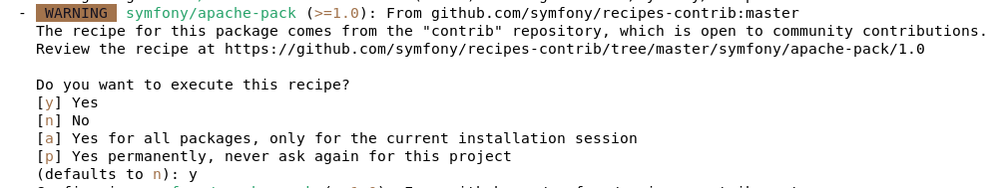

span

<div class="markdown-body">
    <table class="table" style="border: 0; width: 100%">
        <tr>
            <td style="width:20%; background-color: #fff6f8">
                <a href="https://www.univ-grenoble-alpes.fr/" class="simple-text">
                    
                </a>
            </td>
            <td style="width:60%; text-align:center">
                <H3>E-GEPADBAL ©UGA - pôle développement</H3>
                <p><A HREF="mailto:tristan.fleury@univ-grenoble-alpes.fr">tristan.fleury@univ-grenoble-alpes.fr</A></p>
                <p>Licence: <a href="../LICENSE">Apache 2.0</a></p>
            </td>
            <td style="width:20%; background-color: #fff6f8">
                <a href="https://www.esup-portail.org/" class="simple-text">
                    
                </a>
            </td>
        </tr>
    </table>
<h1>E-GEPADBAL - Installation de l'application </h1>
<div>
        <ul>
            <li class="nav-item">
                <a class="nav-link" href="#serveur-web-configuration">Configuration minimum</a>
            </li>
            <li class="nav-item">
                <a class="nav-link" href="#serveur-web-sources">Récupération des sources</a>
            </li>
            <li class="nav-item">
                <a class="nav-link" href="#serveur-web-dependances">Installation des dépendances</a>
            </li>
            <li class="nav-item">
                <a class="nav-link" href="#serveur-web-compilation">Compilation</a>
            </li>
            <li class="nav-item">
                <a class="nav-link" href="#serveur-web-droits">Modification des droits</a>
            </li>
            <li class="nav-item">
                <a class="nav-link" href="#serveur-web-vhost">Configuration du virtual host</a>
            </li>
        </ul>
</div>

L'application GEPADBAL peut être installée de deux façons différentes, soit depuis une image docker, soit sirectement sur un serveur web.

<p id="serveur-web"></p>
<h2>Installation sur un serveur web:</h2>
<p id="serveur-web-configuration"></p>
<h3> Configuration du serveur web:</h3>

* serveur linux 64 bits
* apache + php 7
* node js + npm (sudo apt install nodejs npm) + yarn (sudo npm install --global yarn)
* git
* composer
* ext-soap (sudo apt install php-soap)
* ext-zip (sudo apt install php-zip)
* ext-curl (sudo apt install php-curl)
* ext-dom (sudo apt install php-dom)
* ext-xml (sudo apt install php-xml)
* ext-ldap (sudo apt install php-ldap)
* ext-mbstring (sudo apt install php-mbstring) (phpunit)

<p id="serveur-web-sources"><a href="#top"> HAUT</a></p>
<h3> Récuparation des sources:</h3>

Dans une console, naviguez dans le dossier web de votre serveur (par exemple ./var/www) puis cloner le dépot:

```
git clone https://ledepot gepadbal
```

<p id="serveur-web-dependances"><a href="#top"> HAUT</a></p>
<h3> Installation des dépendances:</h3>
<p>Dans une console, entrez dans le dossier et lancer composer:</p>

```
    cd gepadbal
    composer install
```

<div style="width: 70%; padding-left: 3em; padding-right: 3em;">
    <p>
        <div style="float: left"></div>
        <div style="margin-left: 45px">Si vous rencontrez des difficultés lors de l'installation des dépendances avec composer liées à des limites php, vous pouvez utilisez un fichier [composer.phar](https://getcomposer.org/download/latest-stable/composer.phar) puis dans une commande:
>
> php -d memory_limit=-1 composer.phar install</div>
    </p>
</div>

<div style="width: 70%; padding-left: 3em; padding-right: 3em;">
    <p>
        <div style="float: left"></div>
        <div style="margin-left: 45px">Lors de l'installation il vous sera demandé si vous souhaitez exécuter certaines recipes (symfony flex), accepter les recettes:
        <p></p></p></div>
    </p>
</div>

<p id="serveur-web-compilation"><a href="#top"> HAUT</a></p>
<h3>Compilation:</h3>

A la suite de l'installation des dépendances (via composer), un script (gepadbal.sh) sera exécuté automatiquement pour installer et compiler les autres dépendances javascript.

<div style="width: 70%; padding-left: 3em; padding-right: 3em;">
    <p>
        <div style="float: left"></div>
        <div style="margin-left: 45px">Si ce script échoue (npm, node ou yarn non installé), vous pourrez le relancer directement ce script vai la console:</div>
    </p>
</div>

```
sh gepadbal.sh
```

<div style="width: 70%; padding-left: 3em; padding-right: 3em;">
    <p>
        <div style="float: left"></div>
        <div style="margin-left: 45px">Si vous rencontrez des difficultés lors de la compilation suite à un problème de droits, lancez la commande en sudo:</div>
    </p>
</div>

```
sudo sh gepadbal.sh
```

<p id="serveur-web-droits"><a href="#top"> HAUT</a></p>
<h3>Modification des droits:</h3>

Vous devez ajouter l'utilisateur apache aux droits du dossier par exemple:

```
chown -R www-data:www-data gepadbal
chmod 555 -R gepadbal
```

entrez ensuite dans le dossier:

```
cd gepadbal
```

ajouter les droits d'écriture aux dossiers logs public et var:

```
chmod 775 -R ./logs ./public ./var ./config/gepadbal
```

<p id="serveur-web-vhost"><a href="#top"> HAUT</a></p>
<h3> Configuration du virtual host</h3>

Votre virtual host devra pointer vers le répertoire public du dossier d'installation:

```
#<VirtualHost *:443>
<VirtualHost *:80>
ServerName gepadbal

ServerAdmin webmaster@localhost
DocumentRoot /var/www/gepadbal/public

<Directory /var/www/gepadbal/public/>
DirectoryIndex index.php
FallbackResource /index.php
Options FollowSymLinks
AllowOverride All
Require all granted
<ifModule mod_rewrite.c>
RewriteEngine On
</ifModule>
</Directory>

ErrorLog ${APACHE_LOG_DIR}/error-gepadbal.log
CustomLog ${APACHE_LOG_DIR}/access-gepadbal.log combined
</VirtualHost>
```

Une fois configuré votre dns, vous pourrez ouvrir votre navigateur et vous rendre sur l'url:

```
http(s)://monserveur/gepadbal
```

<a href="#top"> HAUT</a></p>
